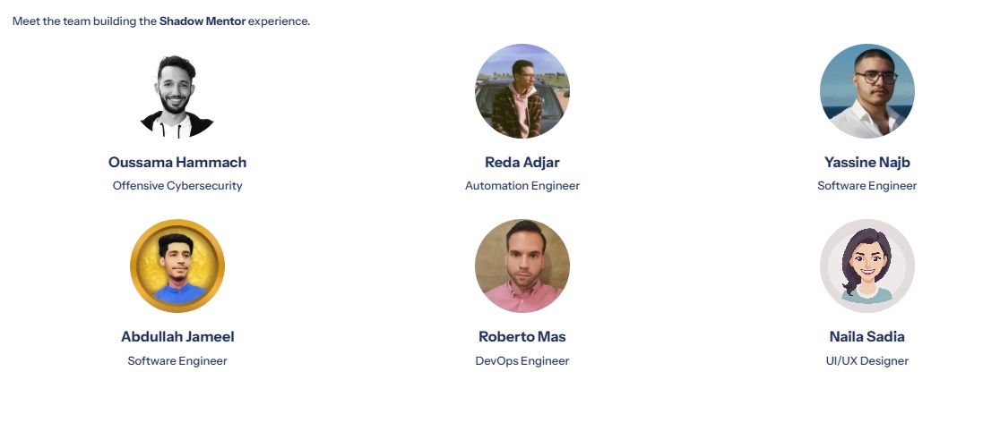

# 👤 The Shadow Mentor: Invisible Onboarding Companion
 <div align="center">
  
</div>

<div align="center">

<!--  -->


**Built for the Agentic AI Hackathon with IBM watsonx Orchestrate**

</div>

 <div align="center">
  
</div>


## 🏆 Hackathon

This project was developed for the **Agentic AI Hackathon with IBM watsonx Orchestrate**.

## 👥 Team

<div align="center">



**Our Amazing Team:**

- **Oussama Hammach** - Offensive Cybersecurity
- **Reda Adjar** - Automation Engineer
- **Yassine Najb** - Software Engineer
- **Abdullah Jameel** - Software Engineer
- **Roberto Mas** - DevOps Engineer
- **Naila Sadia** - UI/UX Designer

</div>

<div align="center">
  
</div>

## 💡 About The Shadow Mentor

The Shadow Mentor is an AI-powered solution built on **IBM Watsonx** designed to address the HR challenge of post-onboarding "ghosting." This phase typically occurs after the first week, when new hires start feeling lost and productivity declines as managers become busier. The solution acts as an **Invisible Onboarding Companion** that supports continuous cultural and functional integration.

## 🧠 Core Innovation & Features

The agent operates on an intelligent loop: **Perceive → Decide → Act**.

### 🔍 Perceive (Integration Gaps)
The agent analyzes the new hire's activity using Watsonx Skills (calendar access, Slack integration, HRIS data). It identifies integration gaps such as:
- Missing 1:1 meetings
- Unaccessed onboarding resources
- Incomplete tasks
- Low engagement indicators

### 🎯 Decide (Role-Based Needs)
It consults its knowledge base to determine what the employee needs next, including:
- Identifying their role level (Junior/Senior)
- Recommending relevant certification paths
- Suggesting learning roadmaps
- Matching with appropriate mentors

### ⚡ Act (Discreet Intervention)
The agent intervenes proactively by:
- **Automatically scheduling** short check-ins on the manager's calendar with suggested talking points
- **Sending personalized Slack reminders** with direct links to incomplete tasks
- **Providing real-time support** without being intrusive

## ✨ Key Employee Features

### 📊 Intelligent Provisioning & Performance Tracking
- New employees receive **role-specific challenges** and an **initial project** monitored by the Shadow Mentor
- **Performance scoring** system tracks progress
- **Structured assessments** with limited retakes before progressing to certificates
- Real-time project monitoring and task completion tracking

### 📚 Follow-Up & Continuous Development
- Tracks progress across **certification paths**
- Displays **personalized roadmaps** for each role (e.g., Software Engineer, Data Scientist, DevOps Engineer)
- Provides **salary progression insights** based on upcoming certifications
- Shows certification completion status and next steps

### 📅 Smart Scheduling
- **Smart calendar** organizes daily tasks and meetings
- Switch between **active (AI-driven)** or **manual scheduling** modes
- **Predictive indicator** shows whether the employee's pace is aligned with peers
- Automatic meeting scheduling and conflict detection

### 🤝 Cultural Integration
- Enhances cultural onboarding by **pairing new hires with a Buddy** based on shared interests
- Facilitates team connections and social integration
- Tracks cultural engagement metrics

The Shadow Mentor ensures that every new employee remains **connected, productive, and supported** from their very first day.

<div align="center">
  
</div>

## 🚀 Getting Started

### Prerequisites

- Node.js 18+ and npm
- Python 3.8+ (for backend API)
- IBM Watsonx Orchestrate account and credentials

### Installation

#### Frontend Setup

```bash
# Install dependencies
npm install

# Start development server
npm run dev
```

Open [http://localhost:5173](http://localhost:5173) to view the application.

#### Backend API Setup

```bash
# Navigate to IBM WATSONX CONNECTION folder
cd "IBM WATSONX CONNECTION"

# Install Python dependencies
pip install -r requirements.txt

# Configure your Watson credentials in config.py
# Set your API_KEY and AGENT_ID

# Start the API server
python start_server.py
```

The API server will run on `http://localhost:5000`

### Build for Production

```bash
# Build frontend
npm run build

# Preview production build
npm run preview
```

<div align="center">
  
</div>

## 📁 Project Structure

```
Shadow_Mentor/
├── src/
│   ├── pages/
│   │   ├── LandingPage.jsx          # Landing page
│   │   ├── Dashboard.jsx             # Admin dashboard
│   │   ├── EmployeeDashboard.jsx    # Employee dashboard
│   │   ├── EmployeeView.jsx         # Individual employee details
│   │   ├── AdminPanel.jsx           # Admin settings
│   │   ├── Certifications.jsx       # Certification management
│   │   ├── Schedule.jsx              # Scheduling interface
│   │   └── ...
│   ├── utils/
│   │   └── watsonApi.js             # Watson API client
│   ├── App.jsx                      # Main app with routing
│   └── main.jsx                     # Entry point
├── IBM WATSONX CONNECTION/
│   ├── watson_connection.py         # Core Watson connection
│   ├── employee_functions.py        # Employee-related functions
│   ├── certification_functions.py  # Certification functions
│   ├── performance_functions.py     # Performance tracking
│   ├── scheduling_functions.py     # Scheduling functions
│   ├── admin_functions.py           # Admin functions
│   ├── api_server.py                # Flask API server
│   └── config.py                    # Configuration
├── public/
│   └── Shadow Mentor Logo.png
└── package.json
```

<div align="center">
  
</div>

## 🛠️ Technologies

### Frontend
- **React 18** - UI library
- **Vite** - Build tool and dev server
- **Tailwind CSS** - Utility-first CSS framework
- **Framer Motion** - Animation library
- **Recharts** - Data visualization
- **Lucide React** - Icon library
- **React Router** - Navigation

### Backend
- **Python 3.8+** - Backend language
- **Flask** - Web framework
- **IBM Watsonx Orchestrate** - AI agent platform
- **Requests** - HTTP library


## 🎨 Design Features

- **Dark Theme** with orange/amber accent colors
- **Fully Responsive** - works on mobile, tablet, and desktop
- **Smooth Animations** using Framer Motion
- **Interactive Charts** with Recharts
- **Glass Morphism** UI elements
- **Gradient Accents** throughout

## 🎯 Key Pages

### Employee Dashboard (`/employee-dashboard`)
- Employee information display
- Initial project assignment and tracking
- Certification roadmap with PDF links
- Salary insights and projections
- Performance tracking (score, tests, project monitoring)
- Smart calendar with daily tasks and meetings
- Predictive clock for productivity tracking

### Admin Dashboard (`/dashboard`)
- Real-time statistics
- Onboarding progress charts
- Role distribution visualization
- Integration gaps alerts
- Recent employees table
- Live activity feed

### Learning & Performance
- **My Learning** (`/my-learning`) - Certifications and learning paths
- **My Schedule** (`/my-schedule`) - Calendar and task management
- **My Performance** (`/my-performance`) - Performance metrics and insights

<div align="center">
  
</div>

## 🔧 Configuration

### Watson Orchestrate Setup

1. Edit `IBM WATSONX CONNECTION/config.py`:
   ```python
   API_URL = "https://api.eu-gb.watson-orchestrate.cloud.ibm.com/instances/YOUR_INSTANCE_ID"
   API_KEY = "your-api-key-here"
   AGENT_ID = "your-agent-id-here"
   ```

2. Test the connection:
   ```bash
   cd "IBM WATSONX CONNECTION"
   python test_connection.py
   ```

### Frontend API Configuration

The frontend is configured to connect to the API server at `http://localhost:5000` by default. You can modify this in `src/utils/watsonApi.js`:

```javascript
const API_BASE_URL = 'http://localhost:5000/api';
```

<div align="center">
  
</div>

## 📚 API Documentation

See [IBM WATSONX CONNECTION/README.md](./IBM%20WATSONX%20CONNECTION/README.md) for detailed API documentation.

### Quick API Examples

```javascript
// Get employee information
const employee = await employeeApi.getEmployee('EMP-1001');

// Get certification roadmap
const roadmap = await certificationApi.getRoadmap('Software Engineer');

// Get performance score
const performance = await performanceApi.getPerformance('EMP-1001');

// Get daily tasks
const tasks = await schedulingApi.getTasks('EMP-1001');
```

---

## 🎨 Color Palette

- **Primary Orange**: `#F59E0B`
- **Dark Background**: `#0F0F0F`
- **Secondary Dark**: `#1A1A1A`
- **Tertiary Dark**: `#262626`

---

## 📱 Responsive Breakpoints

- Mobile: < 640px
- Tablet: 640px - 1024px
- Desktop: > 1024px

<div align="center">
  
</div>

## 🤝 Contributing

This project was developed as part of the Agentic AI Hackathon with IBM watsonx Orchestrate. For questions or contributions, please contact the team.

## 📄 License

MIT License - See LICENSE file for details

## 🙏 Acknowledgments

- **IBM Watsonx Orchestrate** for providing the AI agent platform
- **Hackathon organizers** for the opportunity
- **Our amazing team** for their dedication and hard work

<div align="center">
  
</div>

<div align="center">

**Built with ❤️ by the Shadow Mentor Team**

*Ensuring no new hire gets left behind*

</div>
